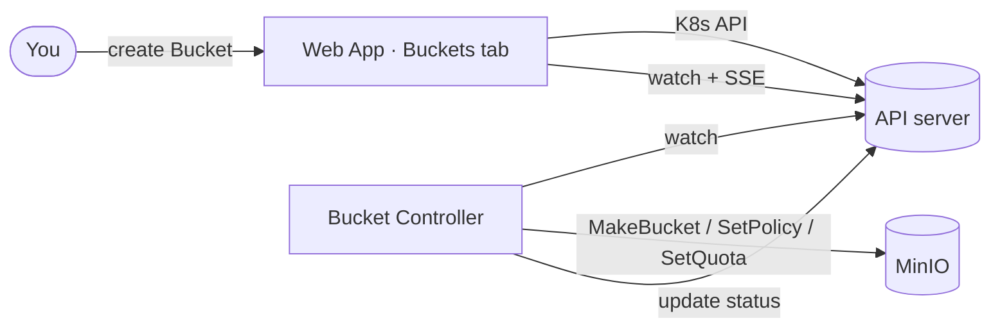

# 06 · Buckets — Kubernetes as a cloud API (extension)

Time: ~15 minutes. Optional module — do it after the core flow (steps 01–05).

This module adds a **second** custom resource, `Bucket`, and shows the *other* big operator
pattern. Where `ReportRequest` makes the controller create a Kubernetes **Job**, `Bucket`
makes the controller provision a resource in an **external system** — MinIO — directly from
its reconcile loop.

> The big idea: a `Bucket` is a **domain object** ("I want object storage, private, capped
> at 100Mi"). You declare it in YAML; the controller makes it real. This is exactly how
> Crossplane and the AWS/GCP/Azure operators turn Kubernetes into the control plane for a
> whole cloud. Here we build a tiny **local cloud**: `kubectl apply` → a real bucket.

## Learning objectives

- Contrast two operator styles: **create K8s objects** (Jobs) vs **provision external state**.
- See why external resources need a **finalizer** — owner references can't garbage-collect
  things that live outside the cluster.
- Apply a domain API (`accessPolicy`, `quota`) that maps onto real backend calls.

## Architecture



The controller uses two MinIO clients: the **S3 API** (`minio-go`) for create/policy and the
**admin API** (`madmin-go`) for the quota — quotas aren't part of S3, they're a MinIO feature
(the same thing `mc admin bucket quota` uses).

## Prerequisites

You've completed steps 01–04: the cluster is up, MinIO is deployed, and the controller image
is built/loaded. The Bucket controller ships **in the same controller binary** as the
ReportRequest controller — if step 04 is deployed, the logic is already there. This module
just adds the CRD, the controller's RBAC + MinIO credentials, and the UI (all included in the
updated manifests).

## 1. Install the Bucket CRD

```bash
kubectl apply -f manifests/bucket-crd.yaml
kubectl get crd buckets.storage.workshop.io
```

`kubectl get buckets -n report-queue` now works — but nothing acts on Buckets yet. (Same
"a CRD is just data" lesson as step 03.)

## 2. Re-apply the controller (RBAC + credentials)

The controller needs permission on `buckets` and the real MinIO keys (it talks to MinIO
itself, unlike the worker flow). Both are in the updated manifest:

```bash
kubectl apply -f 04-controller/controller.yaml
kubectl rollout restart deploy/report-controller -n report-queue
```

If you also want the **Buckets tab** in the web UI, re-apply the web app (its Role now
includes `buckets`) and rebuild its image if you're on the offline path:

```bash
./scripts/build-and-load.sh        # offline path: rebuild web-app image
kubectl apply -f 02-app/web-app.yaml
kubectl rollout restart deploy/web-app -n report-queue
```

## 3. Create a bucket

Either from YAML:

```bash
kubectl apply -f 06-buckets/sample-bucket.yaml
kubectl get buckets -n report-queue -w
```

…or from the UI: open <http://localhost:8080>, click the **Buckets** tab, and create one.

Watch the phase go `Pending → Ready`. Then confirm it's real in MinIO:

```bash
# Port-forward the MinIO console and log in with minioadmin / minioadmin
kubectl port-forward -n report-queue deploy/minio 9001:9001
# open http://localhost:9001  → you should see the new bucket(s)
```

## 4. See the finalizer (the key lesson)

```bash
kubectl get bucket analytics-exports -n report-queue -o jsonpath='{.metadata.finalizers}'
# => ["storage.workshop.io/finalizer"]
```

Now delete it. Because `analytics-exports` has `deletionPolicy: Delete`, the controller
removes the real bucket *before* Kubernetes drops the object:

```bash
kubectl delete bucket analytics-exports -n report-queue
# the controller empties + removes the MinIO bucket, then clears the finalizer
```

Compare with `public-assets` (`deletionPolicy: Retain`): deleting the resource leaves the
MinIO bucket intact. Try both and watch the MinIO console.

> Why a finalizer at all? Owner references only garbage-collect **Kubernetes** objects. A
> MinIO bucket isn't one — so without a finalizer, deleting the resource would silently
> orphan it. Finalizers are how operators clean up external state.

## The spec

| Field | Meaning |
| ----- | ------- |
| `bucketName` | The S3 bucket to create in MinIO (3–63 chars, DNS-style). |
| `accessPolicy` | `private` (default) or `public-read` (anonymous `s3:GetObject`). |
| `quota` | Max total size as a Kubernetes quantity, e.g. `100Mi`, `2Gi`. Omit for none. |
| `deletionPolicy` | `Retain` (default) or `Delete` the real bucket on resource deletion. |

## Troubleshooting

- **Phase `Failed`, message about credentials** — the controller can't reach MinIO. Check
  `MINIO_ENDPOINT/MINIO_ACCESS_KEY/MINIO_SECRET_KEY` env on the controller Deployment and
  that the `minio-credentials` Secret exists.
- **Bucket stuck `Pending`** — the controller isn't running or lacks RBAC on `buckets`.
  Check `kubectl logs deploy/report-controller -n report-queue` and that you re-applied
  `04-controller/controller.yaml`.
- **Delete hangs** — the finalizer is waiting on the controller. If the controller is down,
  the object won't disappear until it's back (that's the finalizer doing its job).

## Challenge ideas

- Add a `versioning: true` field and call `SetBucketVersioning` in the controller.
- Surface live bucket **usage** (bytes used vs quota) in `status` via the admin API.
- Add `status.conditions` instead of a single `phase`.

---

Back to [`05-wrap-up/`](../05-wrap-up/) · or the [top-level README](../README.md).
