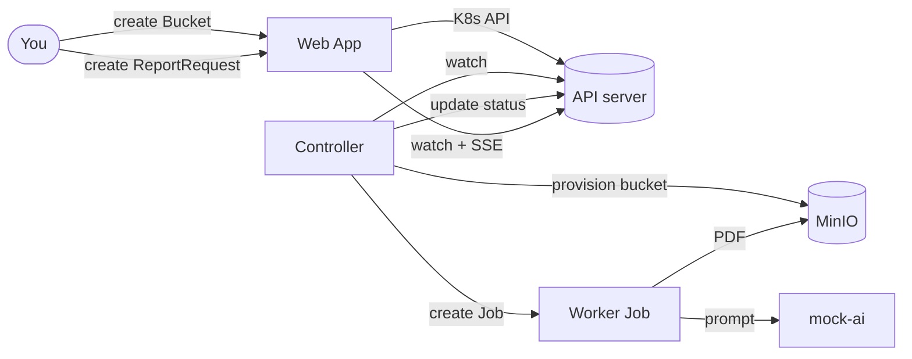

# 06 · Wrap-up

Time: ~10 minutes.

## What you built



You stood up a real operator — one controller reconciling **two** custom resources: a
`Bucket` (provisioned directly into MinIO, cleaned up with a finalizer) and a
`ReportRequest` (turned into a Kubernetes **Job** that renders a PDF into that bucket) — with
a UI that reflects status **live**.

## The ideas to take home

1. **Everything is declarative.** You describe desired state; controllers make it real.
2. **The API server is the hub.** Components watch it; they don't call each other.
3. **A CRD is just data.** Behaviour comes from a controller — together they form an
   *operator*.
4. **The reconcile loop** continuously closes the gap between `spec` (desired) and the world
   (actual), writing results to `status`.
5. **Owner references** give you automatic cleanup (garbage collection) for Kubernetes
   objects — and **finalizers** do the same for *external* state (the MinIO bucket).
6. **Kubernetes can be the API for anything.** A `Bucket` resource provisioned real object
   storage — the same pattern Crossplane and the cloud operators use.

## Extension challenges

Pick one and explore — starter code lives in [`src/`](../src/).

- **Use a real AI provider.** The mock-AI service already supports OpenAI: set
  `AI_PROVIDER=openai` and an `OPENAI_API_KEY` secret on the `mock-ai` Deployment.
- **Add retries / backoff.** Make the worker fail sometimes and have the controller handle
  it gracefully (it already respects the Job's `backoffLimit`).
- **Add a finalizer to `ReportRequest`.** Delete its PDF from MinIO on deletion, before the
  object is removed (the `Bucket` controller already shows the pattern).
- **Add status conditions.** Replace the single `phase` with richer
  `status.conditions` (the convention used by built-in resources).
- **Add printer columns.** Already done for Phase/Title/Job — add "Completed At".
- **Scale the workers.** What happens with 50 requests at once? Add concurrency limits.

## Clean up

```bash
./scripts/cleanup.sh
```

This deletes the entire kind cluster — no leftovers on your machine.

## Going deeper

- Kubebuilder book — <https://book.kubebuilder.io/>
- controller-runtime — <https://pkg.go.dev/sigs.k8s.io/controller-runtime>
- The Operator pattern — <https://kubernetes.io/docs/concepts/extend-kubernetes/operator/>

Thanks for building along!
