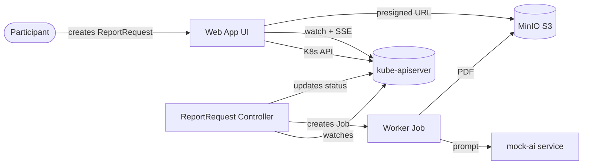

# Kubernetes Controllers Workshop — "AI Report Queue"

A hands-on workshop that demystifies Kubernetes internals and the **operator / controller
pattern** by building one running scenario end-to-end.

Participants create `ReportRequest` custom resources through a small web UI. A controller
reacts to each request by spawning a Kubernetes **Job** that calls a (mock) AI service,
renders a PDF financial report, and stores it in MinIO. The UI shows the status changing
**live** — `Pending → Processing → Completed` — with a download link for the finished PDF.

> The point of the scenario: a Custom Resource Definition (CRD) is just *data* in the
> Kubernetes API. It only becomes useful when a **controller** continuously reconciles the
> desired state you declared with the actual state of the world. You'll feel this directly
> in step `03` (nothing happens) versus step `04` (the controller brings the CR to life).

## Agenda (~100 minutes)

| Part | Folder | Time | What happens |
| ---- | ------ | ---- | ------------ |
| Presentation | [`intro/`](intro/) | 15 min | Why Kubernetes now (sovereign cloud + AI), the control-loop mental model |
| Setup (live) | [`01-setup/`](01-setup/) | 20 min | Verify tools, create kind cluster, ingress ready, k9s ready |
| Deploy app stack | [`02-app/`](02-app/) | 15 min | Deploy web app + MinIO + mock-AI and open the UI |
| Buckets — first CRD | [`03-buckets/`](03-buckets/) | 10 min | Apply the Bucket CRD, create the `reports` bucket, observe inert data |
| Controller | [`04-controller/`](04-controller/) | 15 min | Deploy the controller; the `reports` bucket is provisioned in MinIO; finalizers |
| Reports — the pipeline | [`05-reports/`](05-reports/) | 20 min | Create `ReportRequest`s; Jobs render PDFs into the bucket; owner refs / GC |
| Wrap-up | [`06-wrap-up/`](06-wrap-up/) | 10 min | Recap; beginner-safe & advanced extension challenges |

## Facilitator mode for mixed experience

Use one shared path through the build (steps 03–05), then pick extension challenges in the
wrap-up (step 06).

- Pairing strategy: pair one Kubernetes-experienced participant with one beginner/interested participant.
- Beginner-safe target: read status, inspect Buckets and Jobs, recover from the missing-bucket failure drill.
- Advanced target: modify controller behavior (finalizer/conditions/retries) and validate end-to-end.
- Setup fallback: if setup overruns the 20-minute timebox, proceed with one facilitator machine demo while participants follow command output and k9s views.

## Architecture



0. First, a `Bucket` custom resource provisions the `reports` object store in MinIO (steps
   03–04). The report pipeline depends on it — the worker no longer creates it implicitly.
1. The web app creates a `ReportRequest` custom resource via the Kubernetes API.
2. The controller's reconcile loop sees it, sets `phase: Pending`, and creates a worker **Job**
   (owned by the CR via an owner reference).
3. The worker calls the mock-AI service, renders a PDF, and uploads it to MinIO.
4. The controller watches the Job and updates the CR status to `Completed` (or `Failed`).
5. The web app **watches** `ReportRequest` objects and streams live updates to the browser
   over Server-Sent Events; the finished PDF is served through a MinIO presigned URL.

## Repository layout

```
intro/                  reveal.js presentation (open index.html in a browser)
01-setup/ … 06-wrap-up/ numbered workshop steps, each with a README + manifests
src/                    buildable source for all container images
  web-app/              TypeScript app (Express backend + static frontend)
  controller/           Go controller (controller-runtime)
  worker/               Go worker run by each Job (AI call + PDF + MinIO upload)
  mock-ai/              tiny mock AI report service (deterministic, no API key)
scripts/                create-cluster.sh, build-and-load.sh, cleanup.sh, kind-config.yaml
manifests/              shared CRDs (ReportRequest, Bucket) + namespace referenced by the steps
```

## Prerequisites

You'll install these in [`01-setup/`](01-setup/), but to save venue time, ask participants
to install them beforehand:

- **Docker Desktop** (or another Docker-compatible engine)
- **kubectl** — the Kubernetes CLI
- **kind** — Kubernetes IN Docker, for a local cluster
- **k9s** — a terminal UI for exploring clusters

## Two ways to run the workshop

The container images can be obtained two ways. Pick one before the workshop:

1. **Prebuilt images (default, fastest)** — images are pulled from a public registry.
   Requires internet at the venue. Set the registry in `scripts/env.sh`.
2. **Build locally + load into kind (offline-capable)** — run
   `scripts/build-and-load.sh` to build every image and load it straight into the kind
   node. Slower, but needs no registry.

Both paths are documented in [`01-setup/`](01-setup/).

## Quick start (facilitator)

```bash
# 1. Create the cluster
./scripts/create-cluster.sh

# 2. Build images and load them into kind (offline path)
./scripts/build-and-load.sh

# 3. Follow the numbered steps from 02 onward
```

When you're done: `./scripts/cleanup.sh` deletes the cluster.
